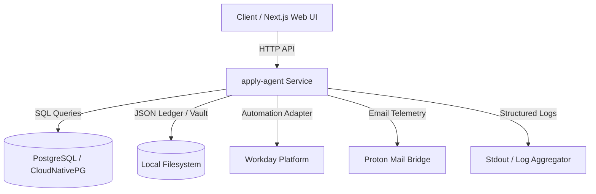

# apply-agent Documentation

Welcome to the **apply-agent** system documentation. `apply-agent` is an autonomous job application processing service designed to automate job searching, application submission, safety verification, and telemetry tracking.

## Overview & Architecture

`apply-agent` operates as a TypeScript service supporting local file-backed ledger storage (`ledger.json`) or high-availability PostgreSQL database storage (CloudNativePG). It integrates with job application platforms (Workday), a Next.js web console dashboard, and local email communication bridges (Proton Mail Bridge).



## Documentation Index

- **[Architecture & Environment Boundaries](architecture.md)**: System design, component responsibilities, and local workstation vs. Talos/Kubernetes cluster deployment boundaries.
- **[Browser Automation & Safety Policy](browser-automation.md)**: `BrowserAutomationAdapter` interface, Playwright and agent-browser hybrid runtimes, domain execution policies, and safety submit invariants.
- **[Development Slices & Roadmap](slices.md)**: Details on implemented system slices (LLM adapters, interactive form filling, email verification, approval gates, and telemetry persistence).
- **[Deployment Guide](deploy.md)**: Detailed instructions for local workstation execution, CloudNativePG cluster configuration, environment secrets management, and resource limits.
- **[Testing Strategy](testing.md)**: Guidelines for running unit, database integration mock tests, and deterministic fixture validation.
- **[Event Lifecycle](events.md)**: Specifications for application event schema, canonical status transitions, and blocker codes.
- **[Observability & Metrics](metrics.md)**: Structured JSON log schemas, database event telemetry, and health probe check specification.
 - **[Practical Operator Runbook](runbook.md)**: Step-by-step guide for local testing, vault onboarding, LLM configuration, application creation, approval flows, Kubernetes dry-run/apply, port-forwarding, and manual handoffs.

## Quick Start

To build and run `apply-agent` locally:

```bash
# Install dependencies
npm install
npm install --prefix web

# Compile TypeScript and copy assets
npm run build

# Start local server
npm start

# Run Next.js web UI in development mode
npm run dev --prefix web
